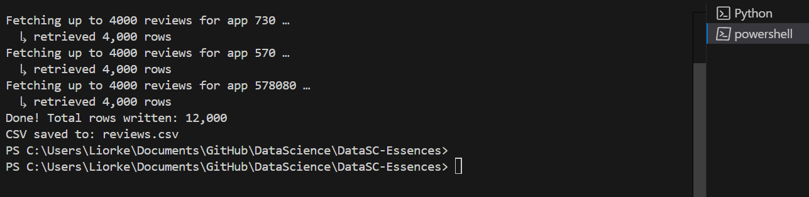

# DataSC-Essences
Data Science Essences project- steam store
For the data collection- we used the command:
"python steam_scraper.py --apps 730 570 578080 --limit 4000 --outfile reviews.csv"
in the terminal.

With that we collected the data that we needed (12,000 rows) in csv file "reviews.csv".

The tools that we used were:

*requests library – does the actual web-request: “GET this Steam URL, give me the JSON back.”
*argparse (built-in) – lets us pass flags like --apps 730 instead of hard-coding numbers.
*csv module (built-in) – writes each review line-by-line into reviews.csv.

An example of an **anomaly** in our data set:
"578080,169750537,1720860019,1,2194,0.937738180160522461,2 likes and i'll uninstall this game"
it's useful_score got 0.937 which is the highest in our data set, and the user did a thumbs up (which mean he liked the game) so you might think it's just a profesional and positive review that got a lot of likes. Meanwhile- it's quite the opposite - the user stated that if he gets more than 1 like he will delete the game- it seems that a lot of users found this funny and therefore he got a lot of likes. It wasn't a "useful" review after all.

🔍"SentenceTransformer" What does this do?
from sentence_transformers import SentenceTransformer
model = SentenceTransformer('all-MiniLM-L6-v2')
X = model.encode(df['text'])
1. Loads a pre-trained language model
python
Copy
Edit
model = SentenceTransformer('all-MiniLM-L6-v2')
That’s a tiny but powerful neural network trained by huggingface + Microsoft, designed to turn entire sentences into meaningful numeric vectors.

Unlike TF-IDF, it understands:

grammar

negation ("not")

sarcasm